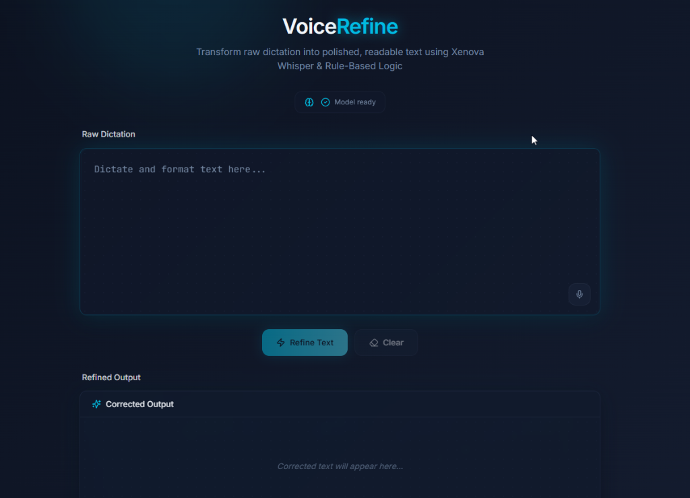
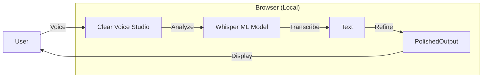

# Clear Voice Studio

**Clear Voice Studio** (internally "VoiceRefine") is a powerful, privacy-first web application for recording, transcribing, and refining voice dictation. 

Unlike traditional cloud-based transcription services, Clear Voice Studio runs a state-of-the-art machine learning model (**Whisper**) entirely inside your browser. This means **your voice data never leaves your device**.



## 🌟 Features

- **Private & Secure**: 0% data egress. Everything runs locally via WebAssembly.
- **Real-Time Transcription**: Uses `Xenova/whisper-tiny.en` for fast, accurate speech-to-text.
- **Smart Refinement**: Automatically cleans up filler words, fixes casing, and organizes unstructured speech into readable text.
- **Audio Visualization**: Visual confirmation that your microphone is working.
- **Debug Instrumentation**: Built-in panels to analyze audio levels, model status, and performance stats.

## 🏗️ Architecture

For a detailed breakdown of how the application works, including component diagrams and data flow, please check out our [Architecture Documentation](docs/architecture.md).



## 🚀 Getting Started

### Prerequisites
- Node.js (v18 or higher recommended)
- npm

### Installation

1.  Clone the repository:
    ```bash
    git clone https://github.com/RichardAnthonySanchez/clear-voice-studio.git
    cd clear-voice-studio
    ```

2.  Install dependencies:
    ```bash
    npm install
    ```

3.  Start the development server:
    ```bash
    npm run dev
    ```

4.  Open your browser to the local URL provided (usually `http://localhost:5173`).

## 🤝 Contributing

We welcome contributions to make Clear Voice Studio even better! Here's how you can help:

### Who is this for?
- **Journalists & Writers**: Draft articles simply by speaking.
- **Developers**: Learn how to implement client-side ML models.
- **Privacy Advocates**: Use speech-to-text without sending audio to Big Tech.

### How to Contribute
1.  **Fork** the repository.
2.  **Create a branch** for your feature (`git checkout -b feature/amazing-feature`).
3.  **Commit** your changes.
4.  **Push** to the branch.
5.  Open a **Pull Request**.

### Areas for Improvement
- Support for larger/multilingual Whisper models.
- Improved text refinement rules.
- Export functionality (Markdown, PDF).
- PWA support for offline usage.

## 📄 License

This project is licensed under the MIT License.
