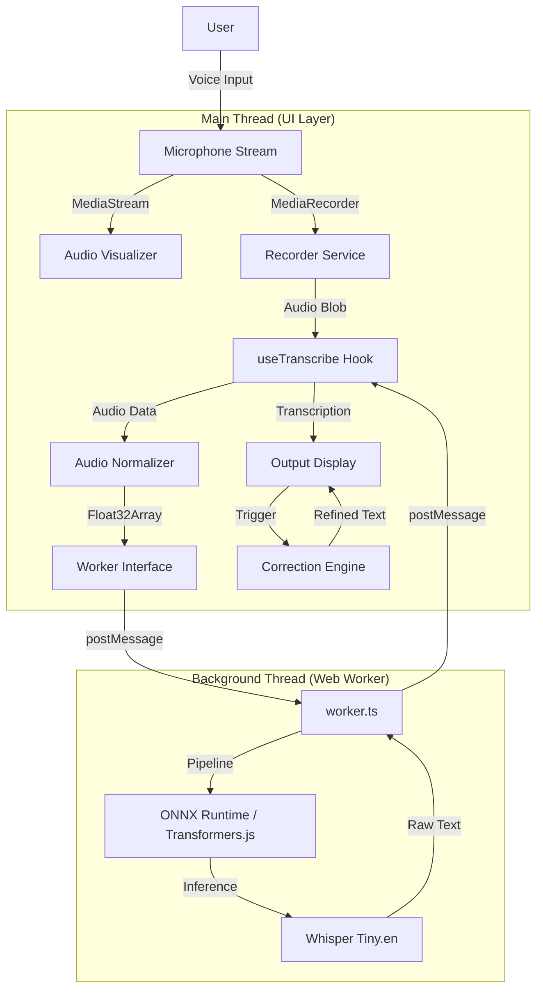
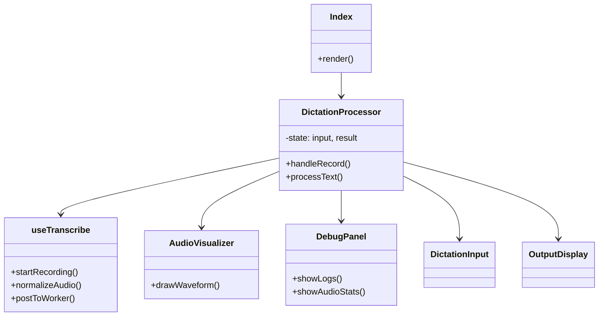

# Architecture Documentation

## System Overview

Clear Voice Studio is a privacy-first, browser-based voice transcription and refinement application. It leverages WebAssembly and Web Workers to run the Whisper speech-to-text model entirely within the user's browser, ensuring that audio data never leaves the device.

## High-Level Architecture

The application follows a unidirectional data flow, orchestrated by React hooks interacting with a dedicated Web Worker for heavy ML processing.

## Component Structure

Key React components and their responsibilities:

## Data Flow Details

### 1. Audio Capture & Normalization
- **Capture**: `MediaRecorder` captures audio chunks from the user's microphone in `audio/webm` format.
- **Decoding**: The blob is decoded into an `AudioBuffer` using the Web Audio API at a forced sample rate of 16kHz (required by Whisper).
- **Normalization**: The `useTranscribe` hook calculates the Peak and RMS amplitude. If the audio is outside the target range, gain is applied to normalize the signal to ~0.95 Peak.

### 2. Transcription (Web Worker)
- **Offloading**: Normalized `Float32Array` audio data is sent to `worker.ts` via `postMessage`.
- **Inference**: The worker uses `@xenova/transformers` to run the quantized `Xenova/whisper-tiny.en` model.
- **Result**: The text is returned to the main thread and appended to the transcription state.

### 3. Text Refinement
- **Engine**: A rule-based `correctionEngine.ts` processes the raw transcription.
- **Operations**:
  - Fixes casing and sentence boundaries.
  - Removes filler words (um, uh).
  - Normalizes spacing and punctuation.
  - Expands common contractions (e.g., from "gonna" to "going to").

## File Structure

- `src/components/`: UI components (Inputs, Visualizers, Debug Panels).
- `src/hooks/`: Custom hooks logic (`useTranscribe`).
- `src/lib/`: Pure utility functions (`correctionEngine`).
- `src/worker.ts`: The background script for ML inference.
